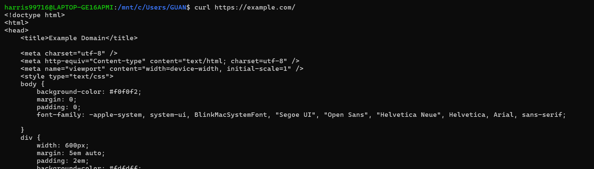

# 1. package.json 中的 dependencies 與 devDependencies 分別是什麼
Ans: dependencies 是專案執行時所需要的套件，例如：如果套件需要處理 HTTP 請求，那麼 dependencies 應該加入 Express
，而 devDependencies 是專案開發所需要的套件。
例如: 
1. 測試框架：Mocha
2. 編譯工具:：Typescript
3. 打包工具：Webpack
4. 語法檢查工具：ESLint

# 2. package.json 中的 scripts 這個區塊怎麼用？
以下是一個簡單的範例
```json
{
  "scripts": {
    "start": "node app.js",
    "build": "webpack --config webpack.config.js",
    "test": "jest",
    "lint": "eslint ."
  }
}
```

script 用來自訂一些指令，可使用`npm run <script-name>`
script-name 可填入上面例子的 start, build, test, lint,...等


# 3. Port number 要怎麼以環境變數來設定？
可以透過修改 process.env 來設定環境變數
以下是範例程式
``` javascript
const express = require('express');
const app = express();

const port = process.env.PORT || 3000;
// 如果 process.env.PORT 沒有值 (為NULL 或 undefined)，則設為3000

app.listen(port, () => {
    console.log(`Server is running on port ${port}`);
});

```


#  4. 關於哪些檔案應該要被放上 github repo 這個問題，描述看看為什麼你選擇上傳某些檔案、選擇不上傳某些檔案，決策的要素是什麼？

- 應該上傳的檔案:
1. 程式碼
2. README 
3. 環境配置 Dockerfile, package.json (requirement.txt)
4. .gitignore


- 不應上傳的檔案
1. 敏感性資料，如：密碼、API token
2. 依賴套件 (使用者自行下載即可)，如果上傳到 github repo 會佔用空間
3. 開發者IDE的資訊，如：.vscode, .idea


# 5. 範例程式中用 require，但上週的 Stack 是用 import/export，這兩種分別是 JavaScript 引用模組的兩種方式: CJS vs ESM，這兩者分別怎麼用？
CJS（CommonJS）和 ESM（ECMAScript Modules）是 JavaScript 中的兩種模組系統(module system)。

- CJS 的特點是同步加載，意思是程式會等模組加載完畢後才會執行，但如果模組容量很大，加載會很沒效率，主要用於node.js環境，並且為預設的模組系統。

- ESM 使用非同步加載，因此比 CJS 有效率，現代的瀏覽器與 node.js 都有支援。

## CJS 與 ESM 的使用範例
### CJS
CJS 使用 require / module.exports 來引入與匯出模組

``` javascript
// math.js
function add(a, b) {
    return a + b;
}

function subtract(a, b) {
    return a - b;
}

module.exports = {
    add,
    subtract
};
```
```javascript
// app.js
const math = require('./math'); //不需要寫math.js
console.log(add(3, 5)); // 8
console.log(subtract(3, 2)); // 1
```

### ESM
使用ESM時，需先在package.json中加上 `"type":module;` <br>


ESM 使用 import / export 來引入與匯出模組

```javascript
// math.js
export function add(a, b) {
    return a + b;
}

export function subtract(a, b){
  return a - b;
}
```

```javascript
// app.js
import { add, subtract } from './math.js';

console.log(add(2, 3)); // 5
console.log(subtract(4, 2)); // 2

```

# 6. 進階題:
## 6.1 [localhost](http://localhost) 是什麼？
Ref: https://www.freecodecamp.org/news/what-is-localhost/#:~:text=Well,%20%E2%80%9C127.0.0.1%E2%80%9D%20is%20localhost%20and

host 代表 server (伺服器)，建立 localhost 相當於在本機上建立伺服器，瀏覽器的url 輸入框輸入localhost 或 127.0.0.1，可以使用本機的伺服器，可用於開發及測試。


## 6.2 `curl` 是什麼？查查看怎麼用 curl 來測試網路連線？常用參數有哪些？

`curl` 代表 Client URL，是 CLI 工具，可讓使用者以 CLI 與 各種協定的伺服器 (http, https, ftp) 進行通訊，可用以分析網頁。
以下是常見的參數：
window 的 CLI 不一定適用，我是用 WSL

## 不加參數
curl https://www.google.com.tw/
直接印出網頁原始碼


## -o 
`curl https://example.com -o output.html` <br>
可將網頁的 html 原始碼下載下來


## -L
- 未加上 -L 
`curl https://shorturl.at/gfvr2` <br>
如果是縮網址的話，可能會回應 301 重新導向 


<br>
- 加上 -L
`curl -L https://shorturl.at/gfvr2`
加上-L後就可以印出原始碼


## -I
`curl -I https://example.com` <br>
獲得 header 資訊


## -d
`curl -d "param1=value1&param2=value2" https://example.com` <br>
使用`POST`方法 傳遞參數，常用於表單提交

補充: 與 curl https://example.com/param1=value1&param2=value2 不同，這個指令是發送一個 `GET` 請求，如果是傳遞密碼等敏感資訊不宜用`GET`方法，密碼會直接顯示於網址，應使用`POST`
