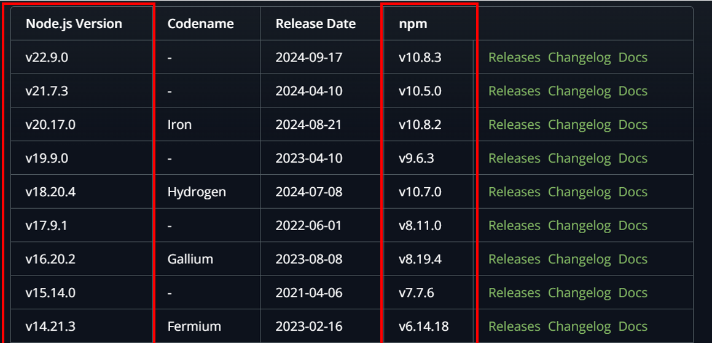

# Node.js環境建置

## [安裝的 nodejs 版本](https://nodejs.org/en/download/package-manager)
目前安裝的版本有18.20.4 及 16.20.2

由於偶數版本是穩定版，不選擇奇數版，20版及22版比較新，怕會有不相容的問題，如果需要使用時再用nvm install來安裝即可

## nvm v.s. npm
### nvm
nvm可至 https://github.com/coreybutler/nvm-windows/releases 下載

下載nvm.setup.exe，接著點擊exe檔，依安裝精靈指示即可安裝

nvm 是 Node.js的版本管理工具
常見的指令如下:
- `nvm install [Node 版本號]` - 安裝特定版本的 Node
- `nvm list` - 列出已安裝清單
- `nvm use [Node 版本號]` - 切換到特定 Node 版本

### npm
npm 是 Node.js的套件管理工具 (像是Python中的pip)
安裝node時，就會下載對應的npm版本
可參考https://nodejs.org/en/about/previous-releases

使用說明如下
1. 在cmd中切換到專案資料夾
`cd <專案資料夾>`
2. 初始化專案資料夾
`npm init`
可依照cmd上的指令填入資訊，亦可以全部按Enter，之後再從package.json修改
`npm init -y` 可以略過填入資訊，直接使用預設值
完成後可以在專案資料夾找到package.json

3. 安裝套件(以nodemon為例)
`npm install nodemon`
這時候專案資料夾產生了一些變化
- 產生 node_modules 資料夾
- 產生 package-lock.json
- package.json多了dependencies屬性

### node_modules 資料夾
node_modules中會包含套件的所有檔案，所以可能非常龐大，

### package-lock.json
安裝套件時，package-lock會紀錄該套件的版本，以及其依賴套件的版本，以確保使用者安裝的版本是一致的

Note: 
如果需要透過import  的方式來匯入套件，需在packages.json加上type: module，這樣 Node.js 就會知道你正在使用 ESM (ES Modules)

參考資料:
https://ithelp.ithome.com.tw/articles/10317941
