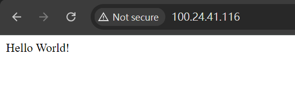
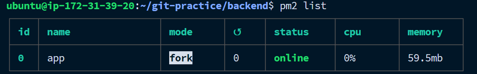
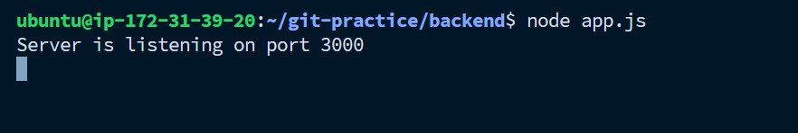
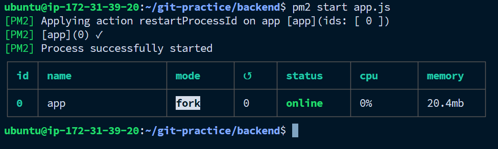

## 1. 在 Readme 中提供 instance 的 public IP，我會連線過去檢查，所以要保持主機是一直在啟動中
Ans: 我的 public IP 是 `100.24.41.116`，在瀏覽器的 url 輸入框輸入 IP，結果如下

## 2. 什麼是 instance type?
Ans: 簡單來說就是 **VM 的規格**，像是 CPU、RAM、輔助記憶體、GPU 的規格等，使用者可根據自己的需求選擇適合的 instance type，比如說如果要做深度學習，就需要較強的GPU，如果是當做資料庫，就需要較大的輔助記憶體。

## 3. 什麼是 Nginx？有哪些用途與特性？
Ans: Nginx 是一個反向代理器，可把接收到的 requests 分配到其他的伺服器，Nginx的優點是可以代理多個伺服器。Nginx也可以作為負載平衡器，當伺服器 A 異常時，可以轉到伺服器 B. 

## 4. pm2 套件是什麼？有什麼用處？
Ans: pm2 像是個 **工作管理員**，管理各種 **node.js 的程式**，
輸入 `pm2 list`，會顯示當前執行的程式。

一般來說，要輸入 `node app.js` 才能啟動伺服器，但他會一直listen，沒辦法用這個 terminal 輸入其他的指令。

pm2 可以讓程式 **背景執行** ，輸入 `pm2 start app.js` 可以啟動伺服器，

這樣就不會一直佔用 terminal

## 5. 步驟 9 中提到的 `proxy` 是什麼意思？為什麼要透過 Nginx 來 `proxy` 到 Express 開發的 Web Server?
    1. 提示 `Reverse proxy` vs `Forward Proxy`

    Ans: 如果只使用 Express 開啟伺服器，那麼只能在本地端通過 localhost 連進去，其他地方無法連到該伺服器。這時候就需要使用 Nginx。Nginx 的做法是，當使用者連到這個伺服器的 IP 時，請求會先到 Nginx 代理伺服器，然後 Nginx 再將請求轉發到指定的 Express 伺服器。

proxy 是代理的意思，分為反向代理 (Reverse proxy) 及 正向代理 (Forward Proxy)。
- 正向代理的例子是 **VPN**，如果我們所在的區域無法存取某個伺服器，那可以先請代理伺服器幫我們發 request 至該伺服器，代理伺器器收到結果後，再傳回來給我們，常聽到的"翻牆"就是利用這個原理。此做法可以隱藏自己的 IP，因為對方只會知道代理伺服器的 IP。
- 反向代理就是 **Nginx**，我們可以發送請求給 Nginx，Nginx 再分配到對應的伺服器，如果伺服器無法回應，可以透過配置文件來設定異常時要轉發到的伺服器，達到負載平衡的效果。

## 6. 在 readme 中提供步驟 9 的 Nginx 設定檔

## 7. Security Group 是什麼？用途為何？有什麼設定原則嗎？

## 8. 什麼是 sudo? 為什麼有的時候需要加上 sudo，有時候不用？
`sudo` 是 superuser do 的簡稱，類似Windows的 **以系統管理員身份執行**，基本上如果會修改到根目錄內的東西，就需要 sudo，比如說安裝軟體、更新軟體、更改系統設定等，如果沒有就不用。

Q: 為什麼 `sudo cd ..`，沒有效果，照理來說提高權限後，cd 應該也能做啊，但 `sudo ls` 又可以做？

9. Nginx 的 Log 檔案在哪裡？你怎麼找到的？怎麼看 Nginx 的 Log？

10. 其他你在過程中遭遇的問題，有找到解答就記錄下來，沒有可以把問題放著，下次上課討論。如果沒有遇到任何問題，也可以回答「無」

11. 列出完成本作業時參考的資料
https://ithelp.ithome.com.tw/articles/10188498

12. (optional) 如果你很初學，不放心自己的過程是否正確，可以紀錄過程，我會盡量幫忙看