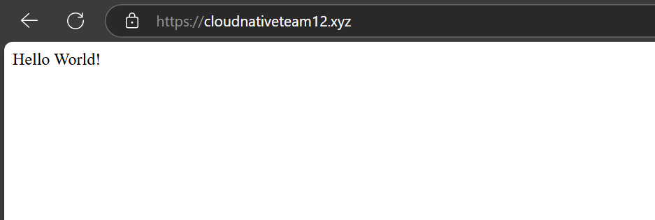

1. 你的網址，應該是 https://www.xxx.xxx，點擊過去應該要可以看到個人作業 4 架設的 Express server （由 Nginx proxy 到 Express）
Ans: 我的網址是 https://www.cloudnativeteam12.xyz/

2. 你在哪裡購買網域的
Ans: 我是在 GoDaddy 買的

3. DNS 的 A record 是什麼？
**A record** 代表 **Address Record** 用來紀錄域名與 IPv4 的對應 (domain name -> IPv4)，這樣瀏覽器就可以知道要連接到哪台伺服器。 (IPv6用AAAA record)

(註: 兩個域名可以指向同一個IP，比如 example.com 和 example.org 都指向 192.0.2.1，原則上這兩個網址會連到同一個網頁，但可以透過設定虛擬主機 (Virtual hosts) 來根據域名產生不同的頁面，做法是在 Nginx 的 /etc/nginx/sites-available/ 中建立多個不同的配置文件(server name 不同)，再用符號連結指到/etc/nginx/sites-enabled/)

4. DNS 的 NS record 是什麼？
**NS record** 代表 **Name Server Record**，

5. Domain Name vs FQDN vs URL 這三者分別為何？

6. 為什麼應該要為網站加上憑證？而不是直接用 http 就好？
Ans: https 使用 SSL（Secure Sockets Layer）來加密資訊，user 的電腦和伺服器會建立一個加密的通道，駭客無法輕易的竊取或篡改資料，這樣子 user 可以在網路上安全的輸入帳號密碼或其他敏感性資料，只使用 http 的話就不夠安全，也會影響到在瀏覽器上的 SEO 排名