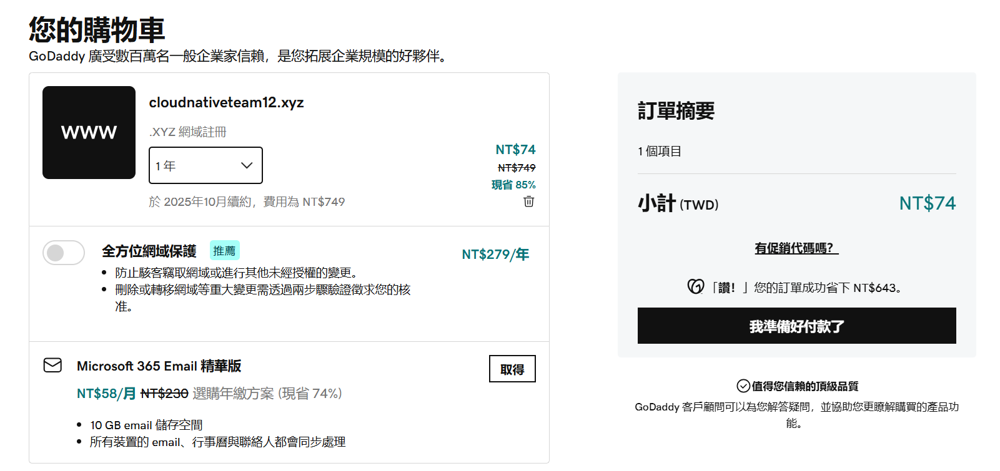

# 1. 你的網址，應該是 https://www.xxx.xxx，點擊過去應該要可以看到個人作業 4 架設的 Express server （由 Nginx proxy 到 Express）
Ans: 我的網址是 https://www.cloudnativeteam12.xyz/

# 2. 你在哪裡購買網域的
Ans: 我是在 GoDaddy 買的

# 3. DNS 的 A record 是什麼？
Ans: **A record** 代表 **Address Record**，用來紀錄域名與 IPv4 的對應 (domain name -> IPv4)，這樣瀏覽器就可以知道要連接到哪台伺服器。 (IPv6 用 AAAA record)

(註: 兩個域名可以指向同一個IP，比如 example.com 和 example.org 都指向 192.0.2.1，原則上這兩個網址會連到同一個網頁，但可以透過設定虛擬主機 (Virtual hosts) 來根據域名產生不同的頁面，做法是在 Nginx 的 /etc/nginx/sites-available/ 中建立多個不同的配置文件(server name 不同)，再用符號連結指到/etc/nginx/sites-enabled/)

# 4. DNS 的 NS record 是什麼？
Ans: **NS record** 代表 **Name Server Record**，用來指定負責該網域解析的名稱伺服器，比如將 example.com 的名稱伺服器設置為 ns1.example.com 和 ns2.example.com，有 2 個以上的名稱伺服器的目的是可以在其中一個異常時，另一個也能使用 (reliabilty)，或者是可以選擇離使用者最近的伺服器來使用。

Name Server: 用來儲存各種 DNS 紀錄，如: A record、AAAA record、CNAME record、MX record、和 NS record。

Q: 從 A record 就可以知道 example.com 對應的 IP 是什麼了，為什麼還要 NS record?
NS record 可以加速查詢，如果 A record 是電話簿的一筆紀錄，NS record 就是存有這筆紀錄的電話簿所在的位置。

# 5. Domain Name vs FQDN vs URL 這三者分別為何？

Ans:
- Domain Name
是網路資源所在的地址，舉例來說 www.example.com 就是個網域名稱，可用 DNS 來查它的 IP。  

    網域由三個部分組成: [TLD](https://zh.wikipedia.org/zh-tw/%E9%A0%82%E7%B4%9A%E5%9F%9F) (一級域名)、[SLD](https://zh.wikipedia.org/wiki/%E4%BA%8C%E7%BA%A7%E5%9F%9F) (二級域名)、Subdomain(子域名)

    (1) 一級域名（TLD）： 網域名稱最右邊的部分，例如 .com、.org

    (2) 二級域名(SLD)： 一級域名左邊的部分，例如 example

    (3) 子域名(Subdomain)： 放在二級域名左邊，例如 www，如果子域名沒寫的話，預設是 www，如: example.com 代表 www.example.com    
    
- FQDN (Fully Qualified Domain Name)
是完整的網域名稱，包含TLD、SLD、Subdomain，最後再加上一個點 . , 代表 root name server，例如 www.example.com.
     
- URL (Uniform Resource Locator)
是網路資源的完整網址，包含協定(http, https)、網域名稱、資源路徑，例如: https://www.example.com/index.html

# 6. 為什麼應該要為網站加上憑證？而不是直接用 http 就好？
Ans: https 使用 SSL（Secure Sockets Layer）來加密資訊，user 的電腦和伺服器會建立一個加密的通道，駭客無法輕易的竊取或篡改資料，這樣子 user 可以在網路上安全的輸入帳號密碼或其他敏感性資料，只使用 http 的話就不夠安全，也會影響到在瀏覽器上的 SEO 排名
